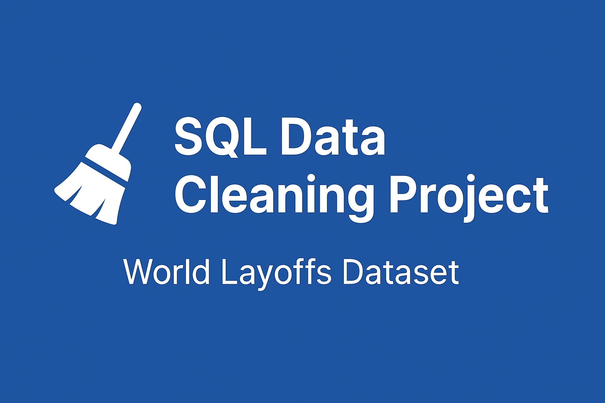

# 🧹 SQL Data Cleaning Project – World Layoffs Dataset

## 📌 Overview
This project demonstrates how I performed **data cleaning using SQL** on the World Layoffs dataset.  
The goal was to remove duplicates, standardize values, handle nulls, and prepare the data for analysis.

I used **MySQL** as the database engine.

---

## 🛠️ Steps Performed

### 1. Remove Duplicates
- Created staging tables to safely clean the raw data.
- Used `ROW_NUMBER()` window function to identify duplicate rows.
- Deleted duplicate records while keeping one valid entry.

### 2. Standardize the Data
- Trimmed extra spaces from company names.
- Standardized industry values (e.g., `Crypto%` → `Crypto`).
- Fixed inconsistent country names (`United States.`, `United States of America` → `United States`).
- Converted text dates to proper `DATE` format.

### 3. Handle Null or Blank Values
- Converted empty strings to `NULL`.
- Filled missing industry values by using other rows from the same company.
- Deleted rows where both `total_laid_off` and `percentage_laid_off` were `NULL`.

### 4. Drop Unnecessary Columns
- Removed helper column (`row_num`) after cleaning.

---

## 📂 Project Files
- `sql/data_cleaning.sql` → SQL script with all data cleaning queries.
- `README.md` → Project documentation.

---


## 🚀 How to Run
1. Clone this repository:
   ```bash
   git clone https://github.com/PELLURUMANASA/sql-data-cleaning.git
